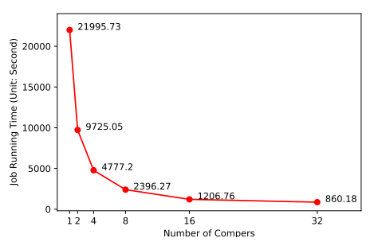
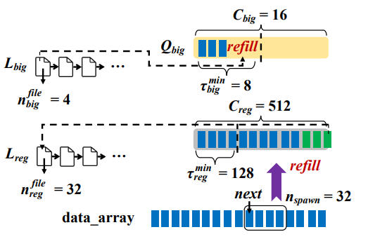
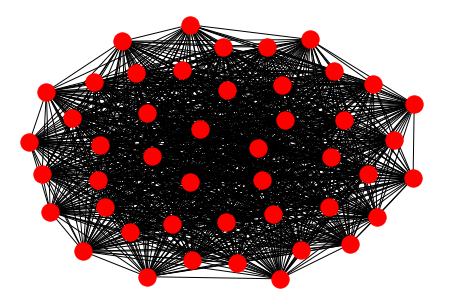

# Parallel Mining of Large Maximal Quasi-Cliques

This project develops a parallel solution for mining maximal quasi-cliques that is able to fully utilize CPU cores. Our solution utilizes divide and conquer to decompose the overall mining workloads into independent tasks for parallel mining, and we addressed the problem of (i) drastic load imbalance among different tasks and (ii) difficulty in predicting the task running time and the time growth with task-subgraph size, by (a) using a timeout-based task decomposition strategy, and by (b) utilizing a priority task queue to schedule long-running tasks earlier for mining and decomposition to avoid stragglers.

We target a **single-machine multi-core** environment, since a distributed cluster is not always readily available to an average end user while most modern computers are multi-core. Our system achieved a close to ideal speedup ratio as illustrated in the figure below for the [YouTube](https://snap.stanford.edu/data/com-Youtube.html) dataset.

<p align="center">
  
</p>

Previously, we developed a distributed solution which can be found [here](https://github.com/yanlab19870714/gthinkerQC), which is built on top of the [G-thinker](http://bit.ly/gthinker) system.

## Program Checklist
- **The `system` folder:** it contains the code for our T-thinker engine, which is a task-based general-purpose framework for writing parallel programs. In the folder, `worker.h` is the main thread that creates other computing threads (aka. compers) to work on tasks. When task queues are near empty, T-thinker will generate new tasks from data items to refill the queues; while if too many tasks are created (e.g. due to decomposing a big task), tasks will be spilled to local disk to keep memory bounded, and these tasks will be loaded back for processing when task queues have space. The figure below shows the tuned system parameters for our task queues:

<p align="center">

</p>

- **The `app_qc` folder:** this is the application code for mining maximal quasi-cliques, which runs on top of T-thinker. The figure below shows an example of the second largest quasi-clique for the [Arxiv GR-QC](https://snap.stanford.edu/data/ca-GrQc.html) dataset (arXiv collaboration network) found by our application code.

<p align="center">

</p>

- **The `app_kernel` folder:** this is the application code for kernel expansion, which uses the top-*k* maximal quasi-cliques found by `app_qc` as seeds, to grow maximal quasi-cliques with a smaller *γ*. This idea was originally proposed by [Sanei-Mehri et al.](https://arxiv.org/abs/1808.09531) to speed up mining of large quasi-cliques, and we improved the method to avoid redundant search space exploration.

- **The `maximal_check` folder:** This is the postprocessing step, used to remove non-maximal quasi-cliques from the output of `app_qc` and `app_kernel`.

## Compilation
In each folder, `app_qc`, `app_kernel` and `maximal_check`, there is a Makefile. Just enter each folder and use the command `make` to compile, and a program named `run` will be generated.

## Execution
**Workflow A: to Mine Maximal Quasi-Cliques Directly**
  1. Quasi-clique mining: go to app_qc folder, then run 
  
  ```./run [input_data] [thread_num] [gamma] [min_size] [time_split_threshold]```

 where: 
      - input_data: input graph file
      - thread_num: number of threads. We call them compers as well
      - gamma: user-specified minimum degree threshold
      - min_size:  minimum size threshold to return only large quasi-cliques
      - time_split_threshold: timeout duration threshold
 
 Example: ```./run grqc_q 5 0.8 10 5```

  2. Postprocessing:
      - Aggregate all quasi-cliques outputs into one file: ```cat output_* > results```
      - Remove non-maximal quasi-cliques: ```../maximal_check/quasiCliques results max_results```

**Workflow B: to Mine Maximal Quasi-Cliques Using Kernels**
  1. Mine large quasi-cliques by first mining dense parts that are faster to find using gamma prime (gamma'), where gamma' > gamma, using ```./run [input_data] [thread_num] **[gamma']** [min_size] [time_split_threshold]```

  2. Postprocessing: 
      - Aggregate all quasi-cliques outputs into one file: ```cat output_* > result```
      - Remove non-maximal quasi-cliques: ```../maximal_check/quasiCliques results max_results```
      - Generate Kernels: ```sort -n -r -k 1 max_results > kernels```

  3. Kernel Expansion:
      - Using the generated kernels (Step 2 above) and the original values of gamma and min_size to expand the results, by selecting the largest k prime (k') kernels. Go to app_kernel folder, and run: ```./run [input_data] [thread_num] [gamma] [min_size] [time_split_threshold] [kernels] [k_prime]```
  4. Top K Kernels
      - Aggregate all k' quasi-cliques outputs into one file: ```cat output_* > results_expanded```
      - Remove non-maximal quasi-cliques: ```../maximal_check/quasiCliques results_expanded max_results_expanded```
      - Generate top K Kernels: 
        - ```sort -n -r -k 1 max_results_expanded > sorted```
        - ```head -n k sorted > topk```

## Demo
Use the following link to run a quasi-cliques mining application using T-thinker in Google Colab jupyter file. Firstly, it clones the repo and download the needed files. Secondly, it runs the quasi-cliques application to find maximal results. Finally, it plots the first and second largest quasi-cliques.

[Click here for the demo](https://shorturl.at/orFN2) 

## Requirements

* C++11
* [OpenMP](https://www.openmp.org/)

## Contributors
* **Jalal Khalil (jalalk@uab.edu)**
* **Da Yan (yanda@uab.edu)**
* **Guimu Guo (guimuguo@uab.edu)**

The authors are with the Department of Computer Science,
University of Alabama at Birmingham
